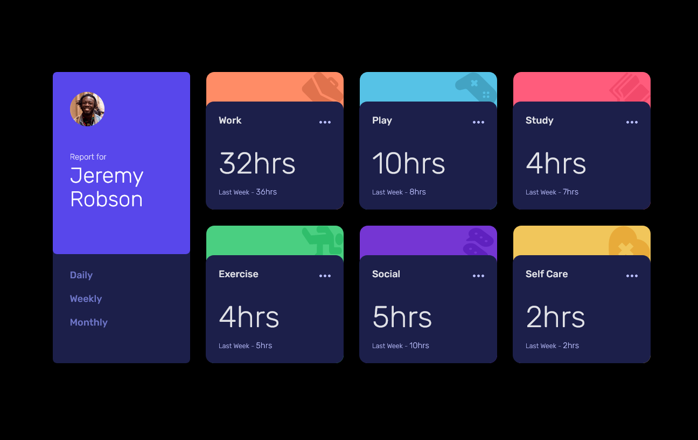
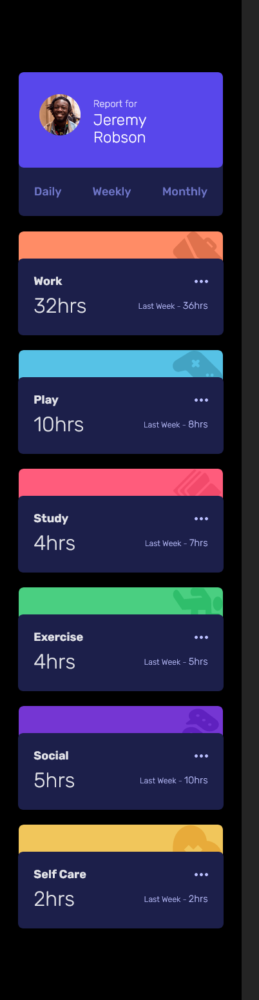

# Frontend Mentor - Time tracking dashboard solution

This is a solution to the [Time tracking dashboard challenge on Frontend Mentor](https://www.frontendmentor.io/challenges/time-tracking-dashboard-UIQ7167Jw). Frontend Mentor challenges help you improve your coding skills by building realistic projects.

## Table of contents

- [Overview](#overview)
  - [The challenge](#the-challenge)
  - [Screenshot](#screenshot)
  - [Links](#links)
  - [Built with](#built-with)
  - [What I learned](#what-i-learned)
- [Author](#author)

## Overview

### The challenge

Users should be able to:

- View the optimal layout for the site depending on their device's screen size
- See hover states for all interactive elements on the page
- Switch between viewing Daily, Weekly, and Monthly stats

### Screenshot




### Links

- Solution URL: [https://github.com/MitaliShah/time-tracking-dashboard](https://github.com/MitaliShah/time-tracking-dashboard)
- Live Site URL: [https://effulgent-squirrel-fb282b.netlify.app/](https://effulgent-squirrel-fb282b.netlify.app/)

### Built with

- Vite
- Semantic HTML5 markup
- CSS custom properties
- Flexbox
- CSS Grid
- Mobile-first workflow
- [React](https://reactjs.org/) - JS library
- [Styled Components](https://styled-components.com/) - For styles

### What I learned

I learned how to conditionally change the background-color based on the title value using styled-components

```js
const Wrapper = styled.div`
  background-color: ${(props) =>
    props.title === "Work"
      ? "var(--work-light-red)"
      : props.title === "Play"
      ? "var(--play-soft-blue)"
      : props.title === "Study"
      ? "var(--study-light-red)"
      : props.title === "Exercise"
      ? "var(--exercise-lime-green)"
      : props.title === "Social"
      ? "var(--social-violet)"
      : props.title === "Self Care"
      ? "var(--self-care-soft-orange)"
      : null};
`;
};
```

## Author

- Frontend Mentor - [@MitaliShah](https://www.frontendmentor.io/profile/MitaliShah)
